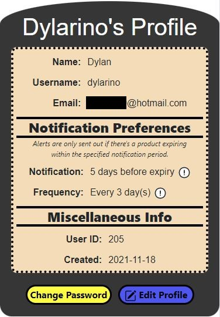
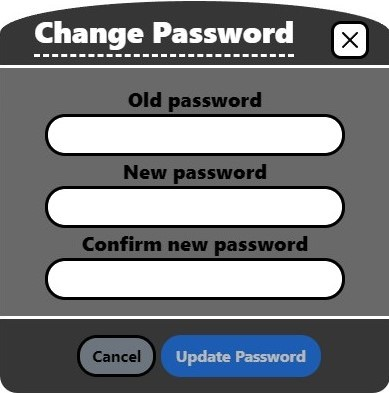

# FridgeMate Expiry Tracker
### Video demo: <URL HERE>
### Description:

The motivation for this project came from a realization that I personally find it difficult to keep track of all the expiry dates for products in my fridge. FridgeMate is a solution to keeping track of any number of expriy dates for products in your fridge. Originally FridgeMate was going to be an iOS app, but upon realizing that swift was restricted to Mac OS, I decided to go with a web application with mobile responsiveness in mind. Originally the notification system was going to be through push notifications on iOS, but after switching to a web application, emails alerts seemed like the best option.

FridgeMate is available on Heroku but since I'm using a free Mailgun account, I can only use 5 registered email addresses, therefore not everyone will be able to try the app. The full demo of the app can be found at the URL above.

**The following sections will describe every aspect of FridgeMate from both a users standpoint and alittle description of what's happening in the background.**

#### Welcome/landing page:
The purpose of the welcome page is to give a brief preview of FridgeMate and allow new users to sign-up. The welcome page was not my primary concern for the app but it was added because the sign-in page didn't express what the app actually does.

The welcome page allowed me to learn how to use the following CSS/Boostrap features:
- Adding a background image to a container
- Use of opacity to make text clear in the overlays
- Learned how to use a timed Bootstrap carousel with information slides on FridgeMate
- Use of ```display: grid;``` to format the slides

The contents of the landing page can be found in ***templates/welcome.html***

#### User registration and login:
Users can get to the registration page via the menu at the top of the screen or the register button on the login page.

Users will be required to enter the following information when registering:
- Name
- Email ***(must be unique)***
- Username ***(5 character minimum and unique)***
- Password ***(5 character minimum and must match password confirmation field)***
- Confirm password ***(must match password field)***

Javascript was used on the registration page to prevent a user from being able to submit the form unless the conditions above are all met. The submit button remains disabled via "```$(#submitBtn).prop("disabled", true)```" until the form data is accepted. Since a user can just go into the browsers developer tools and remove the disabled attribute, a backend safeguard was also applied to verify the same conditions.

The front-end contents of the registration form and login page are located at ***templates/register.html*** and ***templates/login.html*** respectively.

After passing the registration form, the user will need to confirm their email by via a confirmation email containing a personalized link with a unique token generated from their desired username. If the user tries to login before confirming their email, they will be notified that their account is locked until email is verified.

If a user ever happens to forget their password, a forgot password link is located on the login page. The link redirects the user to a basic form where they will need to enter the email associated with their account. If the account is found, an email will be sent to the user with a personalized link with a unique token associated with their username. Clicking the link in the email will redirect the user to a "new password" page. The new password will still have to follow the restrictions put in place to the original password (5 character min).

#### Fridge view:
The fridge view is the main page where users will be able to see all their products with expiry dates laid out in a data-table. Of course at first the users fridge will be empty and they will need to add products via the "add item" button. Everytime a user loads the fridge view page the days left column is updated for all items the user currently has in stock.

The front-end contents of the fridge view page is located at ***templates/fridge_view.html***.

A few features of the fridge view page are:
- Insert
- Search
- Delete (checkbox style selection)
- Sort via column

After adding a few items, the user will have an operational expiry tracking system which will highlight items with certain colors based on their days remaining. An item with 5 days remaining will be highlighted yellow, while an item with 3 days remaining will be highlighted red. All other items with days left are highlighted green unless they're expired. Expired items are greyed out and put to the end of the table.

#### Insert/add item:
Selecting the "insert product" button redirects the user to page with two accordion options. Users will have the option of adding a new product to the fridge or a previously entered product (less effort required). 

The contents of the add item page is located at ***templates/add_item.html***.

The "Add new product" accordion does exactly as the name suggests, the user will be able to type the name of the product in the text field and enter an expiry date via the calendar input. The text input field is equipped with an autocomplete feature which scans a database table "foods" that contains food names to give quick select options. Until the text field and expiry date calendar field are filled in, the submit button will remain disabled via javascript. 
After submitting the form through a post request, the item name and expiry date are added to an "items" table in the database. The new item name will be added to the global (relative to FridgeMate) "foods" table in the database so other users will be able to see that item in the autocomplete dropdown.

The "Add previous product" has a select menu rather then a text field. The menu is made up of a list of every product the user has added to their fridge and allows them to add an item without typing anything. The expiry date calendar input is the same as that found in the "Add new product" form. Both forms are submitted via post to the same route, but the submit buttons themselves have different values which allows the backend route to distinguish between new and previous product data.

After submitting either a new or previous product, a modal will pop-up asking the user if they'd like to add another item or go back to the fridge.

When an item is added to a users table, a simple calculation is done on the backened to get the days left until expiry. The days left column will get updated once daily via a heroku scheduler, regardless of whether or not the user has opened the fridge.

#### User profile:
The profile page started out with just the users name, username and email. As I implemented the email notification aspect of the app, I realized that the user should be in control of when and how often emails are sent out. These notification preferences are only displayed on the profile page, but can be updated along with the users name, username and email via the "Edit Profile" button.

The contents of the profile page is located at ***templates/profile.html***. You'll find the two modals at the bottom of the file.

The "Edit Profile" button triggers a modal pop-up with a form pre-filled with the users current data. The notifications trigger threshold and frequency can be set on a range input within a pre-defined range. The email notifications can be turned off by sliding the notification trigger range all the way to the left.

Users will also have the option to change their passwords from the profile page via the "Change Password" button. After clicking the button, a modal form pops up with three fields (Old password, New password, Confirm new password). The requirement for the old password is due to the fact that the user could've accidentaly left his account signed in and someone else may come along trying to change the password.

A sample profile and settings page can be found below

| Sample profile page | Edit profile page | Change password |
| :---: | :---: | :---: |
|  |  |  |

#### Notification system:
The notification system consists of an email alert/update being sent out whenever an item falls within the users specified notification period (ex. 5 days before expiry). Users have the ability to customize their notification period and frequency of emails, so that they're not overwhelmed with an email everyday. They have the option to turn notifications off altogether by sliding the notification bar all the way to the left (image of example settings in previous section).

A separate python app was written to perform a daily update of every active product in every users fridge. For each user who's fridge contains items within their specified notification period, an email will be sent out to provide the user with a summary of items expiring soon. An email will not be sent out unless the users desired notification frequency is respected (ex. if user sets frequency to every 3 days, they will receive max 1 email in any 3 day period even if new items are coming close to expiry). A user will not receive an email unless items are within the specified notification period.

| Sample email notification |
| :---: |
|  |


